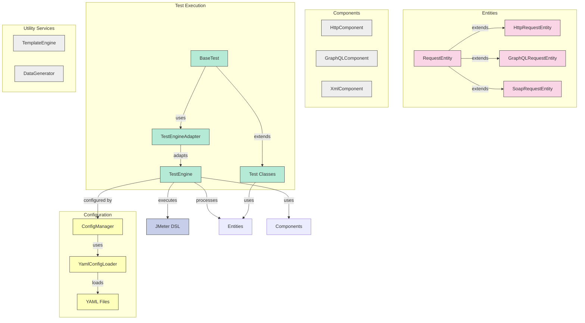
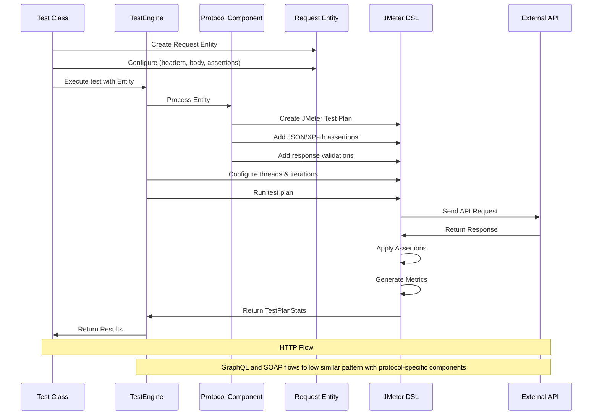

# JMeter DSL Performance Testing Framework

A comprehensive performance testing framework leveraging JMeter DSL for testing various API protocols. The framework follows the Entity-Component-System (ECS) architectural pattern and is designed to test HTTP, GraphQL, and SOAP/XML services.

## Features

- Multi-protocol support (HTTP, GraphQL, XML/SOAP)
- Entity-Component-System (ECS) architecture
- YAML configuration-driven testing
- Fluent Java DSL for test definition
- Template-based request generation with Jinjava
- Data generation with JavaFaker
- Comprehensive JUnit integration
- JSON and XPath-based response validation
- Advanced performance metrics and reporting
- Cross-protocol testing in a single test class

## Getting Started

### Prerequisites

- Java 17+
- Maven 3.8+
- JMeter (handled automatically via JMeter DSL)

### Setup Options

#### Option 1: Local Setup

1. Install Java 17 or later
   ```bash
   # For Ubuntu/Debian
   sudo apt-get update
   sudo apt-get install openjdk-17-jdk

   # For macOS (using Homebrew)
   brew install openjdk@17

   # For Windows
   # Download and install from https://adoptium.net/
   ```

2. Install Maven 3.8+
   ```bash
   # For Ubuntu/Debian
   sudo apt-get install maven

   # For macOS
   brew install maven

   # For Windows
   # Download from https://maven.apache.org/download.cgi and add to PATH
   ```

3. Clone the repository
   ```bash
   git clone https://github.com/yourusername/jmeter-dsl-performance-framework.git
   cd jmeter-dsl-performance-framework
   ```

4. Build the project
   ```bash
   mvn clean install -DskipTests
   ```

#### Option 2: Using Dev Containers (Recommended)

This project includes configuration for development using [VS Code Dev Containers](https://code.visualstudio.com/docs/remote/containers) or [GitHub Codespaces](https://github.com/features/codespaces).

1. Prerequisites:
   - VS Code with [Remote Development extension pack](https://marketplace.visualstudio.com/items?itemName=ms-vscode-remote.vscode-remote-extensionpack)
   - Docker Desktop

2. Open in Dev Container:
   - Open the project folder in VS Code
   - When prompted, click "Reopen in Container"
   - Alternatively, press F1, type "Remote-Containers: Open Folder in Container" and select the project folder

3. The container will be built with all required dependencies (Java 17, Maven 3.9.5, Node.js 20, and JMeter 5.6.2)

4. Once the container is running, you can build and run tests directly from the terminal:
   ```bash
   mvn clean install
   ```

### Running Tests

To run a single test:

```bash
mvn test -Dtest=K6ApiTest#testGetCrocodileById
```

To run all tests:

```bash
mvn test
```

To run with detailed debug logs:

```bash
mvn test -Dtest=K6ApiTest#testGetCrocodileById -DargLine="-Dorg.slf4j.simpleLogger.defaultLogLevel=debug"
```

### Running in CI/CD Environments

The framework is designed to be easily integrated into CI/CD pipelines. Here are setup examples for common CI/CD platforms:

#### GitHub Actions

Create a file at `.github/workflows/performance-tests.yml`:

```yaml
name: Performance Tests

on:
  push:
    branches: [ main ]
  pull_request:
    branches: [ main ]
  schedule:
    - cron: '0 0 * * *'  # Run daily at midnight

jobs:
  test:
    runs-on: ubuntu-latest
    
    steps:
    - uses: actions/checkout@v3
    
    - name: Set up JDK 17
      uses: actions/setup-java@v3
      with:
        java-version: '17'
        distribution: 'temurin'
        cache: maven
    
    - name: Run performance tests
      run: mvn test
    
    - name: Archive test results
      uses: actions/upload-artifact@v3
      if: always()
      with:
        name: test-reports
        path: |
          target/html-reports/
          target/*-test-results.jtl
```

#### Jenkins Pipeline

Create a `Jenkinsfile` in your repository:

```groovy
pipeline {
    agent any
    
    tools {
        jdk 'jdk-17'
        maven 'maven-3.8'
    }
    
    stages {
        stage('Checkout') {
            steps {
                checkout scm
            }
        }
        
        stage('Build') {
            steps {
                sh 'mvn clean compile'
            }
        }
        
        stage('Run Tests') {
            steps {
                sh 'mvn test'
            }
        }
    }
    
    post {
        always {
            archiveArtifacts artifacts: 'target/html-reports/**,target/*-test-results.jtl', fingerprint: true
            junit 'target/surefire-reports/**/*.xml'
        }
    }
}
```

#### GitLab CI

Create a `.gitlab-ci.yml` file:

```yaml
image: maven:3.8-openjdk-17

variables:
  MAVEN_OPTS: "-Dmaven.repo.local=.m2/repository"

cache:
  paths:
    - .m2/repository

stages:
  - build
  - test

build:
  stage: build
  script:
    - mvn compile

test:
  stage: test
  script:
    - mvn test
  artifacts:
    paths:
      - target/html-reports/
      - target/*-test-results.jtl
    reports:
      junit: target/surefire-reports/TEST-*.xml
```

## Configuration

Tests can be configured using YAML files located in `src/test/resources`. The following configuration files are included:

- `http-config.yml` - HTTP test configuration
- `graphql-config.yml` - GraphQL test configuration
- `soap-config.yml` - SOAP/XML test configuration

### Sample HTTP Configuration

```yaml
defaults:
  baseUrl: "https://test-api.k6.io"
  connectTimeout: 5000
  responseTimeout: 10000
  threads: 1
  iterations: 1

tests:
  - name: "Get all crocodiles"
    endpoint: "/public/crocodiles/"
    method: "GET"
    expected_status: 200
    assertions:
      "$[0].name": "*"
```

## Architecture

### Entity-Component-System (ECS) Pattern

The framework is built on the Entity-Component-System (ECS) architectural pattern, which provides a flexible and modular approach to designing complex systems. In our performance testing framework, ECS is implemented as follows:

- **Entities**: Represent the fundamental objects in our system - test requests. Each Entity contains data but no behavior on its own. Examples include `HttpRequestEntity`, `GraphQLRequestEntity`, and `SoapRequestEntity`. These entities store details like URLs, headers, request bodies, and expected assertions.

- **Components**: Provide specific functionality that can be attached to entities. Components contain the logic to process different types of requests. Examples include `HttpComponent`, `GraphQLComponent`, and `XmlComponent`. Each component knows how to handle a specific protocol, but doesn't make decisions about when or how to run tests.

- **Systems**: Coordinate entities and components to execute the workflow. Our primary system is the `TestEngine`, which orchestrates the entire testing process. It takes entities, applies the appropriate components, and manages the execution flow, including thread management, reporting, and result collection.

The ECS pattern offers several benefits for our performance testing framework:

1. **Modularity**: New protocols can be added by simply creating new Entity and Component types without modifying existing code.
2. **Separation of concerns**: Data (Entities), logic (Components), and flow control (Systems) are cleanly separated.
3. **Reusability**: Components can be reused across different entities and test scenarios.
4. **Flexibility**: Entities can be configured at runtime through YAML files or programmatically.

### Architecture Visualization



### API Request Execution Flow



## Protocol Support

The framework currently supports the following protocols:

- **HTTP/REST**: Full support for REST API testing including all HTTP methods, headers, query parameters, and body payloads.
- **GraphQL**: Complete support for queries, mutations, variables, and introspection requests.
- **SOAP/XML**: Support for SOAP services with XML payloads, SOAP actions, and XPath assertions.

> **Note about gRPC support**: Currently, there is no direct gRPC support in JMeter DSL as per this [open issue](https://github.com/abstracta/jmeter-java-dsl/issues/265). Once the JMeter DSL library adds gRPC support, it can be integrated into this framework by adding a new `GrpcRequestEntity` and `GrpcComponent`.

## Examples

### HTTP API Testing

```java
@Test
public void testGetCrocodileById() throws IOException {
    HttpRequestEntity requestEntity = new HttpRequestEntity("https://test-api.k6.io/public/crocodiles/1/");
    requestEntity.setMethod("GET");
    requestEntity.setName("Get Crocodile by ID");
    requestEntity.addAssertion("$.id", "1");
    
    TestPlanStats stats = testEngine.executeHttpTest(requestEntity, 1, 1);
    
    logger.info("Test completed with average time: {}ms", stats.overall().sampleTime().mean());
    logger.info("Error count: {}", stats.overall().errorsCount());
}
```

### GraphQL API Testing

```java
@Test
public void testCountriesGraphQL() throws IOException {
    GraphQLRequestEntity requestEntity = new GraphQLRequestEntity("https://countries.trevorblades.com");
    requestEntity.setName("Get European Countries");
    
    String query = "query { continent(code: \"EU\") { name } }";
    requestEntity.setQuery(query);
    
    requestEntity.addAssertion("$.data.continent.name", "Europe");
    
    TestPlanStats stats = testEngine.executeGraphQLTest(requestEntity, 1, 1);
}
```

### SOAP API Testing

```java
@Test
public void testSoapService() throws IOException {
    SoapRequestEntity requestEntity = new SoapRequestEntity("http://webservices.oorsprong.org/websamples.countryinfo/CountryInfoService.wso");
    requestEntity.setName("Country Info SOAP Service");
    
    String soapBody = "<soapenv:Envelope xmlns:soapenv=\"http://schemas.xmlsoap.org/soap/envelope/\" " +
            "xmlns:web=\"http://www.oorsprong.org/websamples.countryinfo\">\n" +
            "   <soapenv:Header/>\n" +
            "   <soapenv:Body>\n" +
            "      <web:ListOfContinentsByName/>\n" +
            "   </soapenv:Body>\n" +
            "</soapenv:Envelope>";
    
    requestEntity.setBody(soapBody);
    requestEntity.setSoapAction("ListOfContinentsByName");
    
    TestPlanStats stats = testEngine.executeSoapTest(requestEntity, 1, 1);
}
```

## Reports

Test results are saved in the following locations:

- JTL files: `target/{protocol}-test-results.jtl`
- HTML reports: `target/html-reports/{protocol}`

## License

This project is licensed under the MIT License.