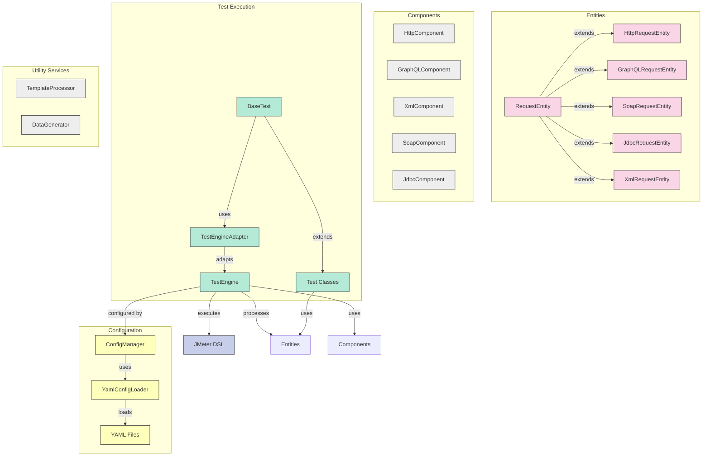
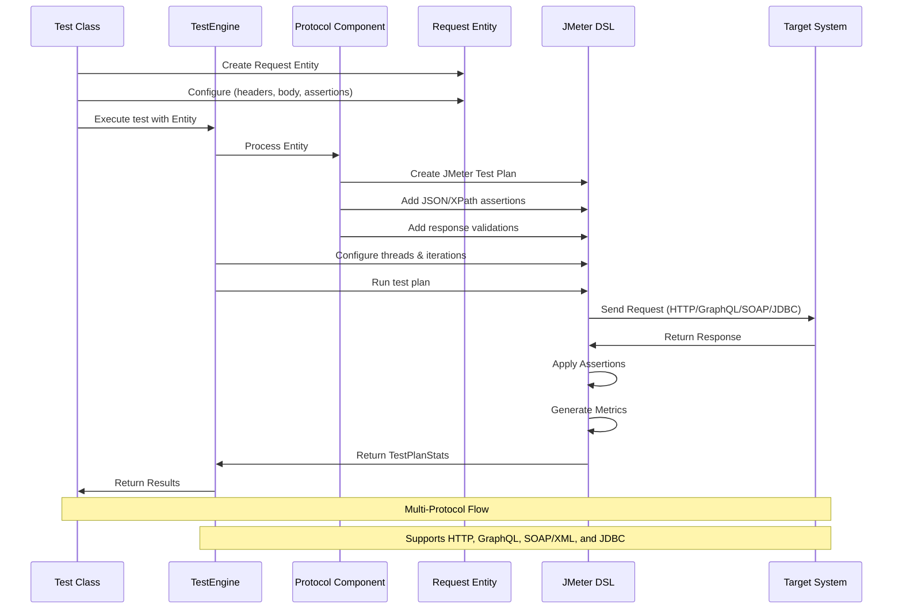

# Performance Automation Framework

This project contains a comprehensive performance testing framework leveraging JMeter DSL for testing various API protocols. The framework follows the Entity-Component-System (ECS) architectural pattern and is designed to test HTTP, GraphQL, SOAP/XML services, and databases via JDBC.

## Overview

The Performance Automation Framework provides:

1. Multi-protocol support (HTTP, GraphQL, XML/SOAP, JDBC)
2. Entity-Component-System (ECS) architecture
3. YAML configuration-driven testing
4. Fluent Java DSL for test definition
5. Template-based request generation with Jinjava
6. Data generation with JavaFaker
7. Comprehensive JUnit integration
8. JSON and XPath-based response validation
9. Advanced performance metrics and reporting
10. Cross-protocol testing in a single test class
11. Real-time metrics visualization with Prometheus and Grafana

## Prerequisites

- Java 17+
- Maven 3.8+
- JMeter (handled automatically via JMeter DSL)

## Usage

1. Navigate to the repository:

```bash
cd PerformanceAutomationFramework
```

2. Build the project:

```bash
mvn clean compile
```

3. Run the tests:

```bash
mvn test
```

4. Run a specific test:

```bash
# HTTP Tests
mvn test -Dtest=SimpleTest
mvn test -Dtest=CustomHttpTest
mvn test -Dtest=HttpYamlConfigTest
mvn test -Dtest=io.perftest.http_tests.K6PublicApiTest
mvn test -Dtest=io.perftest.http_tests.K6CrocodilesApiTest
mvn test -Dtest=io.perftest.http_tests.K6UsersApiTest

# GraphQL Tests
mvn test -Dtest=GraphQLApiTest
mvn test -Dtest=GraphQLYamlConfigTest
mvn test -Dtest=io.perftest.graphql_tests.CountriesApiTest
mvn test -Dtest=io.perftest.graphql_tests.RickAndMortyApiTest
mvn test -Dtest=io.perftest.graphql_tests.GraphQLPlaceholderApiTest

# SOAP Tests
mvn test -Dtest=SoapYamlConfigTest

# JDBC Tests
mvn test -Dtest=SimpleJdbcTest
mvn test -Dtest=JdbcYamlConfigTest

# Multi-Protocol Tests
mvn test -Dtest=MultiProtocolTest
```

## Framework Architecture

The framework is structured using the Entity-Component-System architectural pattern:

- **Entities**: Represent the API requests (HTTP, GraphQL, SOAP, JDBC)
- **Components**: Process and handle requests for specific protocols
- **Systems**: Coordinate test execution, reporting, and assertions

### Key Components

- **TestEngine**: The core coordinator for test execution
- **HttpComponent**: Handles HTTP/REST API requests
- **GraphQLComponent**: Processes GraphQL API requests
- **XmlComponent**: Manages XML API requests
- **SoapComponent**: Manages SOAP API requests
- **JdbcComponent**: Handles database testing via JDBC

### Architecture Visualization



### API Request Execution Flow



## Creating Tests

There are multiple approaches to creating tests with the framework:

### 1. Direct JMeter DSL (Simple)

```java
TestPlanStats stats = testPlan(
    threadGroup(1, 1,
        httpSampler("https://api.example.com/endpoint")
            .method("GET")
            .children(
                responseAssertion().containsSubstrings("200")
            )
    )
).run();
```

### 2. Using Framework Entities (Recommended)

```java
// Create HTTP request entity
HttpRequestEntity request = new HttpRequestEntity("https://api.example.com/endpoint");
request.setMethod("GET");
request.setName("Example API Test");
request.addAssertion("$.data.id", "123");

// Execute the test
TestPlanStats stats = testEngine.executeHttpTest(request, 5, 10);
```

### 3. YAML Configuration-Driven (Scalable)

Create a YAML file with test configurations and use:

```java
Map<String, Object> config = YamlConfigLoader.loadConfig("http-config.yml");
// Parse configuration and execute tests based on the configuration
```

## Protocol Support

The framework currently supports the following protocols:

- **HTTP/REST**: Full support for REST API testing including all HTTP methods, headers, query parameters, and body payloads.
- **GraphQL**: Complete support for queries, mutations, variables, and introspection requests.
- **SOAP/XML**: Support for SOAP services with XML payloads, SOAP actions, and XPath assertions.
- **JDBC**: Support for database testing via JDBC with connection pooling and parameterized queries.

## Example Tests

The framework includes several example tests:

### Implemented HTTP API Tests:

- **K6PublicApiTest**: Tests K6's public API endpoints
- **K6CrocodilesApiTest**: Tests the crocodiles API endpoints
- **K6UsersApiTest**: Tests user authentication and protected endpoints

### Implemented GraphQL API Tests:

- **CountriesApiTest**: Tests the Countries GraphQL API
- **RickAndMortyApiTest**: Tests the Rick and Morty GraphQL API
- **GraphQLPlaceholderApiTest**: Tests the GraphQL Zero placeholder API

### Example HTTP API Testing

```java
@Test
public void testGetCrocodileById() throws IOException {
    HttpRequestEntity requestEntity = new HttpRequestEntity("https://test-api.k6.io/public/crocodiles/1/");
    requestEntity.setMethod("GET");
    requestEntity.setName("Get Crocodile by ID");
    requestEntity.addAssertion("$.id", "1");
    
    TestPlanStats stats = testEngine.executeHttpTest(requestEntity, 1, 1);
    
    logger.info("Test completed with average time: {}ms", stats.overall().sampleTime().mean());
    logger.info("Error count: {}", stats.overall().errorsCount());
}
```

### Example GraphQL API Testing

```java
@Test
public void testCountriesGraphQL() throws IOException {
    GraphQLRequestEntity requestEntity = new GraphQLRequestEntity("https://countries.trevorblades.com");
    requestEntity.setName("Get European Countries");
    
    String query = "query { continent(code: \"EU\") { name } }";
    requestEntity.setQuery(query);
    
    requestEntity.addAssertion("$.data.continent.name", "Europe");
    
    TestPlanStats stats = testEngine.executeGraphQLTest(requestEntity, 1, 1);
}
```

### Example SOAP API Testing

```java
@Test
public void testSoapService() throws IOException {
    SoapRequestEntity requestEntity = new SoapRequestEntity("http://webservices.oorsprong.org/websamples.countryinfo/CountryInfoService.wso");
    requestEntity.setName("Country Info SOAP Service");
    
    String soapBody = "<soapenv:Envelope xmlns:soapenv=\"http://schemas.xmlsoap.org/soap/envelope/\" " +
            "xmlns:web=\"http://www.oorsprong.org/websamples.countryinfo\">\n" +
            "   <soapenv:Header/>\n" +
            "   <soapenv:Body>\n" +
            "      <web:ListOfContinentsByName/>\n" +
            "   </soapenv:Body>\n" +
            "</soapenv:Envelope>";
    
    requestEntity.setXmlBody(soapBody);
    requestEntity.setSoapAction("ListOfContinentsByName");
    
    TestPlanStats stats = testEngine.executeSoapTest(requestEntity, 1, 1);
}
```

### Example JDBC Testing

```java
@Test
public void testJdbcQuery() throws IOException {
    JdbcRequestEntity requestEntity = new JdbcRequestEntity();
    requestEntity.setName("Basic JDBC Test");
    requestEntity.setJdbcUrl("jdbc:mysql://localhost:3306/testdb");
    requestEntity.setJdbcDriverClass("com.mysql.cj.jdbc.Driver");
    requestEntity.setUsername("testuser");
    requestEntity.setPassword("password");
    requestEntity.setQuery("SELECT * FROM users WHERE id = ?");
    requestEntity.addQueryParam(1);
    
    TestPlanStats stats = testEngine.executeJdbcTest(requestEntity, 1, 1);
}
```

## YAML Configuration

Tests can be configured using YAML files located in `src/test/resources`. The following configuration files are included:

- `http-config.yml` - HTTP test configuration
- `graphql-config.yml` - GraphQL test configuration
- `soap-config.yml` - SOAP/XML test configuration
- `jdbc-config.yml` - JDBC test configuration

### Example HTTP Configuration (K6 API)

```yaml
# K6 API Test - Crocodiles Endpoint

protocol: http

execution:
  threads: 5
  iterations: 10
  rampUpSeconds: 2
  holdSeconds: 5

request:
  name: "K6 API - Crocodiles List"
  endpoint: "https://test-api.k6.io/public/crocodiles/"
  method: "GET"
  headers:
    Accept: "application/json"

templates:
  headersPath: "templates/http/headers/default_headers.json"
```

### Example GraphQL Configuration (Countries API)

```yaml
# Countries API Performance Test Configuration

protocol: graphql

execution:
  threads: 5
  iterations: 10
  rampUpSeconds: 2
  holdSeconds: 5

request:
  name: "Countries API - All Countries Query"
  endpoint: "https://countries.trevorblades.com/"
  graphqlQuery: |
    query {
      countries {
        code
        name
        capital
        currency
        languages {
          name
          native
        }
        continent {
          name
        }
      }
    }

templates:
  queryPath: "templates/graphql/body/get_countries.graphql"
  headersPath: "templates/graphql/headers/default_headers.json"
  responsePath:
    success: "templates/graphql/response/success_schema.json"
    error: "templates/graphql/response/error_schema.json"
```

### Example JDBC Configuration

```yaml
defaults:
  jdbcUrl: "jdbc:mysql://localhost:3306/testdb"
  driverClass: "com.mysql.cj.jdbc.Driver"
  username: "testuser"
  password: "password"
  threads: 1
  iterations: 1

queries:
  - name: "Get user by ID"
    sql: "SELECT * FROM users WHERE id = ?"
    params:
      - 1
    assertions:
      "username": "*"
```

## Public APIs Used for Testing

The framework tests the following public APIs:

### HTTP APIs:
- **K6 Test API**: https://test-api.k6.io
  - Public endpoints: `/public/crocodiles/`
  - Auth endpoints: `/auth/token/login/`
  - Protected endpoints: `/my/crocodiles/`

### GraphQL APIs:
- **Countries API**: https://countries.trevorblades.com/
  - Query countries, continents, and languages
- **Rick and Morty API**: https://rickandmortyapi.com/graphql
  - Query characters, episodes, and locations
- **GraphQL Zero (Placeholder)**: https://graphqlzero.almansi.me/api
  - Full GraphQL placeholder with users, posts, todos, etc.

### SOAP APIs:
- **Country Info SOAP Service**: http://webservices.oorsprong.org/websamples.countryinfo/CountryInfoService.wso
  - Get information about countries, currencies, languages, etc.

## Reports and Monitoring

Test results are saved in the following locations:

- JTL files: `target/{protocol}-test-results.jtl`
- HTML reports: `target/html-reports/{protocol}`

These reports provide detailed metrics about your test runs, including response times, throughput, error rates, and more.

### Prometheus Metrics

During test execution, the framework exposes performance metrics via Prometheus on port 9270. These metrics are available for the duration of the test execution and include:

- Response times
- Error counts
- Request rates
- Active threads

### Monitoring Setup

The framework includes a Prometheus and Grafana monitoring stack configuration in the `.docker/prometheus-grafana` directory. This setup requires Docker and Docker Compose to be installed on your system. To use it:

1. Start the monitoring stack:
```bash
./start-monitoring.sh
```

2. Run your performance tests with any of the test workflows

3. Access the dashboards:
   - Prometheus: http://localhost:9090
   - Grafana: http://localhost:3000 (admin/1234)

4. Stop the monitoring stack when finished:
```bash
./stop-monitoring.sh
```

> **Note:** The monitoring stack requires Docker and Docker Compose to be installed on your system. The Prometheus metrics are only available during test execution.

## Advanced Features

- **Templating**: Dynamic request generation with Jinjava templates
- **Data Generation**: Generate realistic test data with JavaFaker
- **Load Testing**: Simulate concurrent users with ramp-up periods
- **Assertions**: Rich assertion capabilities for response validation
- **Cross-Protocol Testing**: Test complex systems with different protocols

## Next Steps

Explore the example tests in `src/test/java/io/perftest/examples` and `src/test/java/io/perftest/http_tests` or `src/test/java/io/perftest/graphql_tests` to see more advanced testing patterns, including:

- Cross-protocol testing in a single test class
- Parameterization and data-driven testing
- Load testing with ramp-up periods
- Custom assertion strategies

## License

This project is licensed under the MIT License.
