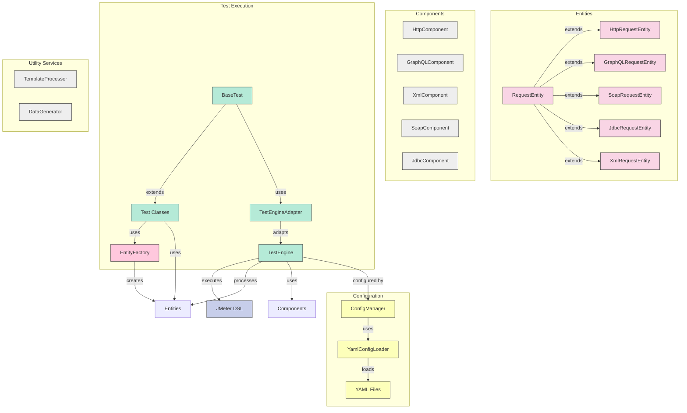
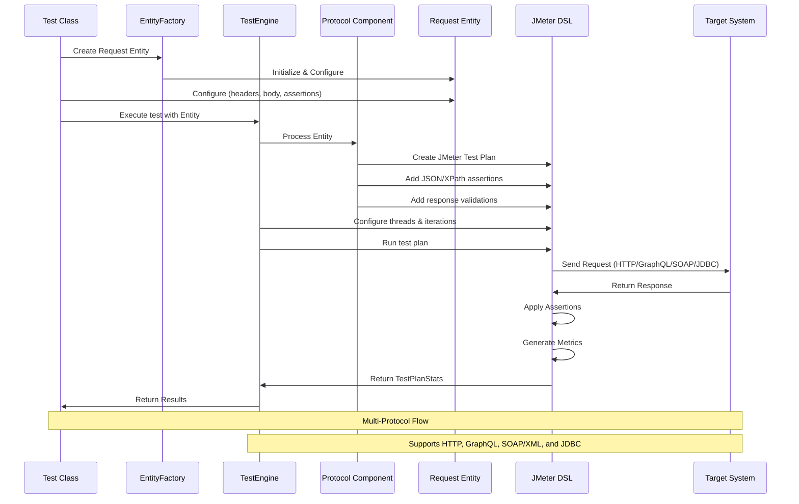

# Performance Automation Framework

This project contains a comprehensive performance testing framework leveraging JMeter DSL for testing various API protocols. The framework follows the Entity-Component-System (ECS) architectural pattern and is designed to test HTTP, GraphQL, SOAP/XML services, and databases via JDBC.

[](https://github.com/username/jmeter-dsl-performance-framework/actions)
[](https://github.com/username/jmeter-dsl-performance-framework/actions)
[](https://github.com/username/jmeter-dsl-performance-framework/releases)
[](https://opensource.org/licenses/MIT)

## Overview

The Performance Automation Framework provides:

1. Multi-protocol support (HTTP, GraphQL, XML/SOAP, JDBC)
2. Entity-Component-System (ECS) architecture
3. YAML configuration-driven testing
4. Fluent Java DSL for test definition
5. Template-based request generation with Jinjava
6. Data generation with JavaFaker
7. Comprehensive JUnit integration
8. JSON and XPath-based response validation
9. Advanced performance metrics and reporting
10. Cross-protocol testing in a single test class
11. Real-time metrics visualization with Prometheus and Grafana
12. Advanced code quality tools integration:
    - SpotBugs for bug detection
    - Checkstyle for code style enforcement
    - JaCoCo for code coverage
13. CI/CD with GitHub Actions (automated tests, static analysis, and releases)
14. Comprehensive documentation with GitHub Pages

## Prerequisites

- Java 17+
- Maven 3.8+
- JMeter (handled automatically via JMeter DSL)

## Code Quality

This project uses several tools to ensure code quality:

### Static Analysis

- **SpotBugs**: Scans code for potential bugs, bad practices, and vulnerabilities
- **Checkstyle**: Ensures consistent coding style and adherence to coding standards
- **SonarLint**: Provides IDE-level code quality feedback (via VSCode extension)

The SpotBugs configuration is located in `config/linting/spotbugs-exclude.xml`, which defines patterns for issues to exclude from analysis.

### Code Coverage

- **JaCoCo**: Measures code coverage of tests
- Coverage reports are generated in `target/site/jacoco`
- Coverage badges are auto-generated and displayed in this README

### Continuous Integration

All code quality checks run automatically on GitHub Actions:

1. On PR creation and updates
2. On merges to main or develop branches
3. Manually via workflow dispatch

### Local Development

To run code quality checks locally:

```bash
# Run SpotBugs
mvn spotbugs:spotbugs
mvn spotbugs:gui  # To view findings in GUI

# Run Checkstyle
mvn checkstyle:check

# Run all verification including tests with code coverage
mvn verify
```

All reports are available in the `target` directory after running these commands.

### Project Structure

```
├── config/                   # Configuration files
│   └── linting/              # Linting configuration
│       └── spotbugs-exclude.xml  # SpotBugs exclusion patterns
├── doc/                      # Documentation files
│   └── entity-factory.md     # Entity Factory documentation
├── src/                      # Source code
│   ├── main/                 # Main source code
│   │   └── java/io/perftest/
│   │       ├── components/   # Protocol-specific components
│   │       ├── ecs/          # Entity-Component-System core
│   │       │   └── exception/# Exception handling framework
│   │       ├── engine/       # Test execution engine
│   │       ├── systems/      # System-level management
│   │       └── util/         # Utilities and helpers
│   └── test/                 # Test source code
│       └── java/io/perftest/
│           ├── core/         # Core framework tests
│           │   └── test/     # Base test classes and core tests
│           └── protocol/     # Protocol-specific tests
│               ├── http/     # HTTP/REST API tests
│               ├── graphql/  # GraphQL API tests
│               ├── jdbc/     # JDBC database tests
│               ├── soap/     # SOAP/XML tests
│               └── multi/    # Multi-protocol tests
└── target/                   # Build output
    ├── logs/                 # Test logs by protocol
    ├── jtl-results/          # JMeter JTL results
    ├── html-reports/         # HTML test reports
    └── spotbugs/             # SpotBugs reports
```

## Usage

1. Navigate to the repository:

```bash
cd PerformanceAutomationFramework
```

2. Build the project:

```bash
mvn clean compile
```

3. Run the tests:

```bash
mvn test
```

4. Run a specific test:

```bash
# HTTP Tests
mvn test -Dtest=SimpleTest
mvn test -Dtest=CustomHttpTest
mvn test -Dtest=HttpYamlConfigTest
mvn test -Dtest=io.perftest.http_tests.K6PublicApiTest
mvn test -Dtest=io.perftest.http_tests.K6CrocodilesApiTest
mvn test -Dtest=io.perftest.http_tests.K6UsersApiTest

# GraphQL Tests
mvn test -Dtest=GraphQLApiTest
mvn test -Dtest=GraphQLYamlConfigTest
mvn test -Dtest=io.perftest.graphql_tests.CountriesApiTest
mvn test -Dtest=io.perftest.graphql_tests.RickAndMortyApiTest
mvn test -Dtest=io.perftest.graphql_tests.GraphQLPlaceholderApiTest

# SOAP Tests
mvn test -Dtest=SoapYamlConfigTest

# JDBC Tests
mvn test -Dtest=SimpleJdbcTest
mvn test -Dtest=JdbcYamlConfigTest

# Multi-Protocol Tests
mvn test -Dtest=MultiProtocolTest
```

## Development Environment

This project includes a fully configured development environment using Visual Studio Code devcontainers. The devcontainer setup provides:

### Features

- Java 17 with Maven 3.9.5
- Node.js 20.x (for potential future front-end components)
- Apache JMeter 5.6.2 with essential plugins
- Docker-in-Docker for running Prometheus and Grafana
- Pre-configured code quality tools

### IDE Extensions

The development container automatically installs VS Code extensions for:

- Java development and debugging
- XML/YAML editing support
- Maven integration
- Docker management
- Code quality tools (SonarLint, Checkstyle, SpotBugs)
- GitHub integration (Actions, PR reviews)
- Markdown linting

### Getting Started with Devcontainer

1. Install [Visual Studio Code](https://code.visualstudio.com/)
2. Install the [Remote Development Extension Pack](https://marketplace.visualstudio.com/items?itemName=ms-vscode-remote.vscode-remote-extensionpack)
3. Clone this repository
4. Open the repository folder in VS Code
5. When prompted, click "Reopen in Container"
   - Or use Command Palette (F1): "Remote-Containers: Reopen in Container"
6. Wait for the container to build and initialize

Once the container is ready, you'll have a fully configured environment with all necessary tools and dependencies.

### Running Tests in the Development Environment

```bash
# Run all tests
mvn test

# Run a specific test class
mvn test -Dtest=HttpYamlConfigTest

# Run tests with JaCoCo coverage
mvn test jacoco:report
```

### Viewing Reports

After running tests, various reports are available:

- JaCoCo coverage: `target/site/jacoco/index.html`
- JMeter HTML reports: `target/html-reports/[protocol]/index.html`
- SpotBugs reports: `target/spotbugs/spotbugs.html`


- **BaseTest**: Base test class with utilities for all tests, located in systems/test package
### Exception Handling System

The framework includes a hierarchical exception handling system aligned with the ECS architecture:

- **EcsException**: Base exception class for all ECS-related exceptions
- **EntityException**: Exceptions related to entity creation and validation
- **ComponentException**: Exceptions occurring during component processing
- **SystemException**: Exceptions occurring in system-level operations
- **Result<T>**: Functional type for handling success and failure states
- **ErrorCode**: Enumeration of error codes organized by ECS component
- **ErrorHandler**: Utilities for handling and converting exceptions
- **ErrorReporter**: Centralized reporting of errors and warnings

## Framework Architecture

The framework is structured using the Entity-Component-System architectural pattern:

- **Entities**: Represent the API requests (HTTP, GraphQL, SOAP, JDBC)
- **Components**: Process and handle requests for specific protocols
- **Systems**: Coordinate test execution, reporting, and assertions

### Key Components

- **TestEngine**: The core coordinator for test execution
- **HttpComponent**: Handles HTTP/REST API requests
- **GraphQLComponent**: Processes GraphQL API requests
- **XmlComponent**: Manages XML API requests
- **SoapComponent**: Manages SOAP API requests
- **JdbcComponent**: Handles database testing via JDBC
- **EntityFactory**: Centralizes creation of request entities (HTTP, GraphQL, SOAP, JDBC)
- **BaseTest**: Base test class with utilities for all tests, located in systems/test package
- **EcsException**: Comprehensive exception handling system following ECS architecture patterns

### Exception Handling System

The framework includes a hierarchical exception handling system aligned with the ECS architecture:

- **EcsException**: Base exception class for all ECS-related exceptions
- **EntityException**: Exceptions related to entity creation and validation
- **ComponentException**: Exceptions occurring during component processing
- **SystemException**: Exceptions occurring in system-level operations
- **Result<T>**: Functional type for handling success and failure states
- **ErrorCode**: Enumeration of error codes organized by ECS component
- **ErrorHandler**: Utilities for handling and converting exceptions
- **ErrorReporter**: Centralized reporting of errors and warnings

### Architecture Visualization



### API Request Execution Flow



## Entity Factory

The `EntityFactory` class centralizes the creation of request entities in the Performance Automation Framework.

### Purpose

The primary goals of the EntityFactory are:

1. **Encapsulate entity creation logic** - Move entity creation out of test classes
2. **Standardize configuration** - Ensure consistent entity configuration across tests
3. **Simplify test code** - Make tests more concise and focused on test scenarios
4. **Support ECS architecture** - Maintain separation between entities, components, and systems

### Usage Examples

#### Creating HTTP Entities

```java
// Create a simple GET request
HttpRequestEntity request = EntityFactory.createHttpEntity("https://api.example.com/users");

// Create a POST request with body
HttpRequestEntity postRequest = EntityFactory.createHttpEntity(
    "https://api.example.com/users",
    "POST",
    "{\"name\": \"John\", \"email\": \"john@example.com\"}"
);

// Load configuration from YAML file
Map<String, Object> config = YamlConfigLoader.loadConfig("http-config.yml");

// Create HTTP entity from config
HttpRequestEntity configRequest = EntityFactory.createHttpEntity(config);
```

#### Creating GraphQL Entities

```java
// Create a GraphQL request
GraphQLRequestEntity request = EntityFactory.createGraphQLEntity(
    "https://graphql.example.com",
    "query { users { id name email } }"
);
```

#### Creating JDBC Entities

```java
// Create a JDBC request
JdbcRequestEntity request = EntityFactory.createJdbcEntity(
    "jdbc:postgresql://localhost:5432/testdb",
    "postgres",
    "postgres",
    "SELECT * FROM users WHERE active = true"
);
```

See `doc/entity-factory.md` for more detailed documentation.

## Creating Tests

There are multiple approaches to creating tests with the framework:

### 1. Direct JMeter DSL (Simple)

```java
TestPlanStats stats = testPlan(
    threadGroup(1, 1,
        httpSampler("https://api.example.com/endpoint")
            .method("GET")
            .children(
                responseAssertion().containsSubstrings("200")
            )
    )
).run();
```

### 2. Using Framework Entities with EntityFactory (Recommended)

```java
// Create HTTP request entity with EntityFactory
HttpRequestEntity request = EntityFactory.createHttpEntity("https://api.example.com/endpoint");
request.setMethod("GET");
request.setName("Example API Test");
request.addAssertion("$.data.id", "123");

// Execute the test
TestPlanStats stats = testEngine.executeHttpTest(request, 5, 10);
```

### 3. YAML Configuration-Driven (Scalable)

Create a YAML file with test configurations and use:

```java
Map<String, Object> config = YamlConfigLoader.loadConfig("http-config.yml");
HttpRequestEntity request = EntityFactory.createHttpEntity(config);
TestPlanStats stats = testEngine.executeHttpTest(request);
```

## Protocol Support

The framework currently supports the following protocols:

- **HTTP/REST**: Full support for REST API testing including all HTTP methods, headers, query parameters, and body payloads.
- **GraphQL**: Complete support for queries, mutations, variables, and introspection requests.
- **SOAP/XML**: Support for SOAP services with XML payloads, SOAP actions, and XPath assertions.
- **JDBC**: Support for database testing via JDBC with connection pooling and parameterized queries.

## Example Tests

The framework includes several example tests:

### Implemented HTTP API Tests:

- **K6PublicApiTest**: Tests K6's public API endpoints
- **K6CrocodilesApiTest**: Tests the crocodiles API endpoints
- **K6UsersApiTest**: Tests user authentication and protected endpoints

### Implemented GraphQL API Tests:

- **CountriesApiTest**: Tests the Countries GraphQL API
- **RickAndMortyApiTest**: Tests the Rick and Morty GraphQL API
- **GraphQLPlaceholderApiTest**: Tests the GraphQL Zero placeholder API

### Example HTTP API Testing

```java
@Test
public void testGetCrocodileById() throws IOException {
    // Using EntityFactory
    HttpRequestEntity requestEntity = EntityFactory.createHttpEntity("https://test-api.k6.io/public/crocodiles/1/");
    requestEntity.setMethod("GET");
    requestEntity.setName("Get Crocodile by ID");
    requestEntity.addAssertion("$.id", "1");
    
    TestPlanStats stats = testEngine.executeHttpTest(requestEntity, 1, 1);
    
    logger.info("Test completed with average time: {}ms", stats.overall().sampleTime().mean());
    logger.info("Error count: {}", stats.overall().errorsCount());
}
```

### Example GraphQL API Testing

```java
@Test
public void testCountriesGraphQL() throws IOException {
    // Using EntityFactory
    GraphQLRequestEntity requestEntity = EntityFactory.createGraphQLEntity(
        "https://countries.trevorblades.com",
        "query { continent(code: \"EU\") { name } }"
    );
    requestEntity.setName("Get European Countries");
    requestEntity.addAssertion("$.data.continent.name", "Europe");
    
    TestPlanStats stats = testEngine.executeGraphQLTest(requestEntity, 1, 1);
}
```

## YAML Configuration

Tests can be configured using YAML files located in `src/test/resources`. The following configuration files are included:

- `http-config.yml` - HTTP test configuration
- `graphql-config.yml` - GraphQL test configuration
- `soap-config.yml` - SOAP/XML test configuration
- `jdbc-config.yml` - JDBC test configuration

### Example HTTP Configuration (K6 API)

```yaml
# K6 API Test - Crocodiles Endpoint

protocol: http

execution:
  threads: 5
  iterations: 10
  rampUpSeconds: 2
  holdSeconds: 5

request:
  name: "K6 API - Crocodiles List"
  endpoint: "https://test-api.k6.io/public/crocodiles/"
  method: "GET"
  headers:
    Accept: "application/json"

templates:
  headersPath: "templates/http/headers/default_headers.json"
```

### Example GraphQL Configuration (Countries API)

```yaml
# Countries API Performance Test Configuration

protocol: graphql

execution:
  threads: 5
  iterations: 10
  rampUpSeconds: 2
  holdSeconds: 5

request:
  name: "Countries API - All Countries Query"
  endpoint: "https://countries.trevorblades.com/"
  graphqlQuery: |
    query {
      countries {
        code
        name
        capital
        currency
        languages {
          name
          native
        }
        continent {
          name
        }
      }
    }

templates:
  queryPath: "templates/graphql/body/get_countries.graphql"
  headersPath: "templates/graphql/headers/default_headers.json"
  responsePath:
    success: "templates/graphql/response/success_schema.json"
    error: "templates/graphql/response/error_schema.json"
```

## Recent Changes and Updates

- Implemented EntityFactory for centralized entity creation
- Moved SpotBugs exclude configuration to dedicated config/linting directory
- Enhanced documentation with detailed EntityFactory examples
- Updated architecture diagram to include EntityFactory
- Fixed critical type incompatibility issues in TestEngine
- Added new test examples using EntityFactory for all protocols
- Improved metrics reporting and visualization

## Updated Project Structure

The project has been reorganized to follow a cleaner architecture and better separation of concerns:

### Test Organization

- Core tests are now in `src/test/java/io/perftest/core/test/`
  - BaseTest.java - The primary test base class for all protocol tests
  - ErrorFrameworkTest.java - Tests for the error handling framework
  - EcsExceptionTest.java - Tests for the exception hierarchy

- Protocol-specific tests are now in `src/test/java/io/perftest/protocol/`:
  - http/ - HTTP/REST API tests
  - graphql/ - GraphQL API tests  
  - jdbc/ - JDBC database tests
  - soap/ - SOAP/XML API tests
  - multi/ - Multi-protocol tests

### Running Tests

```bash
# Run all protocol tests
mvn test -Dtest=io.perftest.protocol.**

# Run specific protocol tests
mvn test -Dtest=io.perftest.protocol.http.**
mvn test -Dtest=io.perftest.protocol.graphql.**
mvn test -Dtest=io.perftest.protocol.jdbc.**
mvn test -Dtest=io.perftest.protocol.soap.**
mvn test -Dtest=io.perftest.protocol.multi.**

# Run core framework tests
mvn test -Dtest=io.perftest.core.test.**
```

### Workflows

The project includes predefined workflows for running different groups of tests:
- CoreTestsWorkflow - Runs all core framework tests
- HttpProtocolTests - Runs all HTTP protocol tests
- GraphQLProtocolTests - Runs all GraphQL protocol tests
- JdbcProtocolTests - Runs all JDBC protocol tests
- SoapProtocolTests - Runs all SOAP protocol tests
- MultiProtocolTestWorkflow - Runs the multi-protocol tests
- ProtocolTests - Runs all protocol-specific tests
